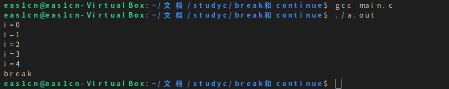

## break

在循环语句中的意思是，循环到了这一轮满足了条件，就执行break跳出循环，即满足之后不再继续执行这个循环
### 实例

~~~c
#include <stdio.h>
int main()
{
int a = 10;

    for ( int i = 0; i < a; i++)
    {
        /* code */
        if (i == 5)
        {
            /* code */
            printf("break\n");
            break;
        }
        printf("i=%d\n",i);
        
    }
}

~~~
输出：

## continue

循环到这一伦满足了条件，则这一轮不执行。

### 实例

~~~c
#include <stdio.h>
int main()
{
    int a = 10;

    for ( int i = 0; i < a; i++)
    {
        /* code */
        if (i == 5)
        {
            continue;
        }
        printf("i=%d\n",i);
        
    }

}
~~~

输出：

## 关系
