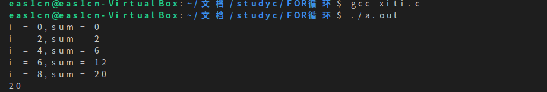
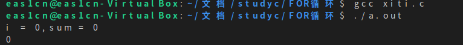

## 题目1

以下代码段的输出是：
~~~c
int sum = 0;
for ( int i=0; i<10; i++ ) {
    if ( i%2 ) continue;
    sum += i;
}
printf("%d\n", sum);
~~~

### 输出结果

## 题目2
以下代码段的输出是：
~~~c
int sum = 0;
for ( int i=0; i<10; i++ ) {
    if ( i%2 ) break;
    sum += i;
}
printf("%d\n", sum);
~~~
### 输出结果
