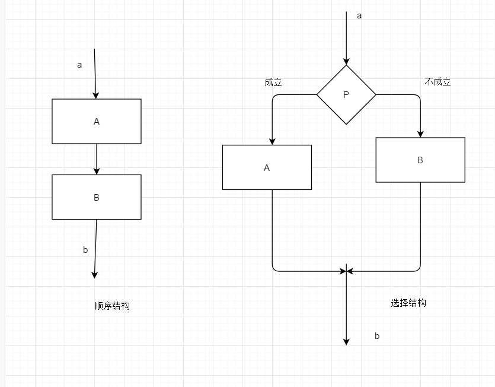
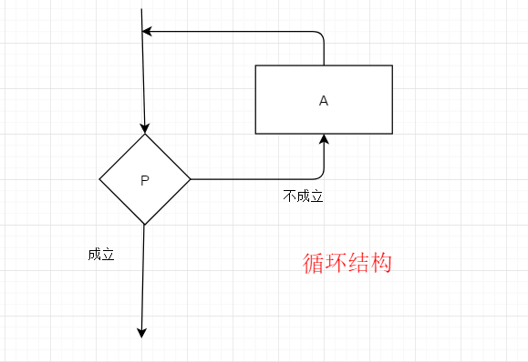
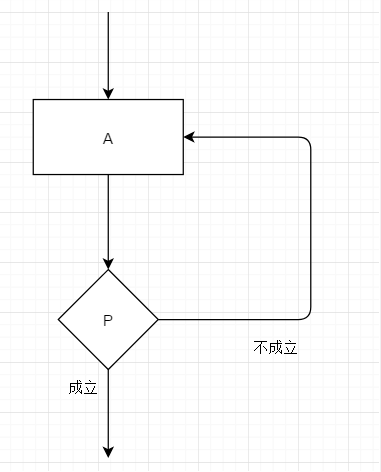
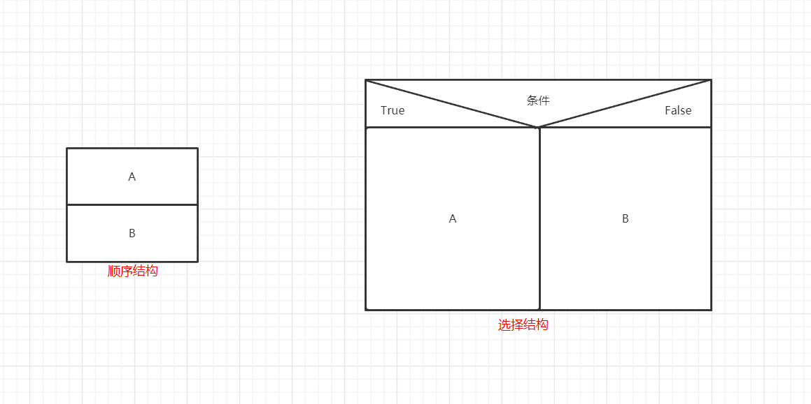
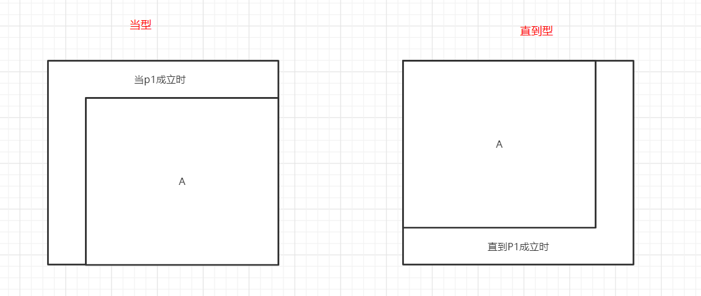

## 算法

数据结构：对数据的描述。

算法：对操作的描述。

沃思公式：算法 + 数据结构 = 程序

## 特性

- 有穷性
- 确定性
- 有零个或者多个输入
- 有一个或者多个输出
- 有效性

## 表示方法

- 自然语言
- 传统流程图
- 结构化流程图（N - S ）
- 伪代码

### 传统流程图

由美国国家标准协会ANSI规定

菱形框：对一个给定的条件进行判断，根据给定的条件是否成立决定如何执行其后的操作

连接点：用相同的标志表示同一个点，将一个流程图的两个部分连接起来。

#### 流程图包括的部分

- 表示相应操作的框
- 带箭头的流程线
- 框内外必要的文字说明

#### 流程图的三种基本结构

##### 顺序结构

顺序执行，是最简单的结构

##### 选择结构

又称`选取结构`或者`分支结构`

必须包含一个判断框

##### 循环结构

又称重复结构（反复执行某一部分的操作）

###### 当型（while型）

当给定条件成立时执行操作，执行之后再判断条件，继续执行

###### 直到型（until型）

先执行操作，然后判断条件

#### 三种结构的共同特点

- 只有一个出口
- 只有一个入口
- 结构中的每一部分都有机会被执行到
- 结构内不存在死循环

由基本结构所构成的算法属于`结构化的算法`，它不存在无规律的转向，只是在本结构内才允许存在分支和向前向后的跳转。

### N-S流程图（结构化流程图）

#### 优点

比文字描述直观形象易于理解

比传统流程图紧凑易画

### 伪代码

