## 介绍

一款为校园内教室设备报修的系统，包括三种角色（管理员，维修人员，普通用户）

## 安装

本系统基于JDK11开发，首先需要在服务器安装jdk。

[Java Platform, Standard Edition 11 Reference Implementations](http://jdk.java.net/java-se-ri/11)

在根目录创建文件夹，然后上传Jar包到服务器

```bash
cd /
mkdir hgnuman
// 上传
```

然后使用以下命令运行：

```bash
sudo -u root nohup /usr/bin/java -jar /hgnuman/hgnuman.jar --server.port=8036 >> /hgnuman/hgnuman.log 2>&1 &
```

等待一分钟左右，访问：ip:8036 查看是否启动成功

## 使用

### 普通用户

首先注册账号，然后登录到系统中

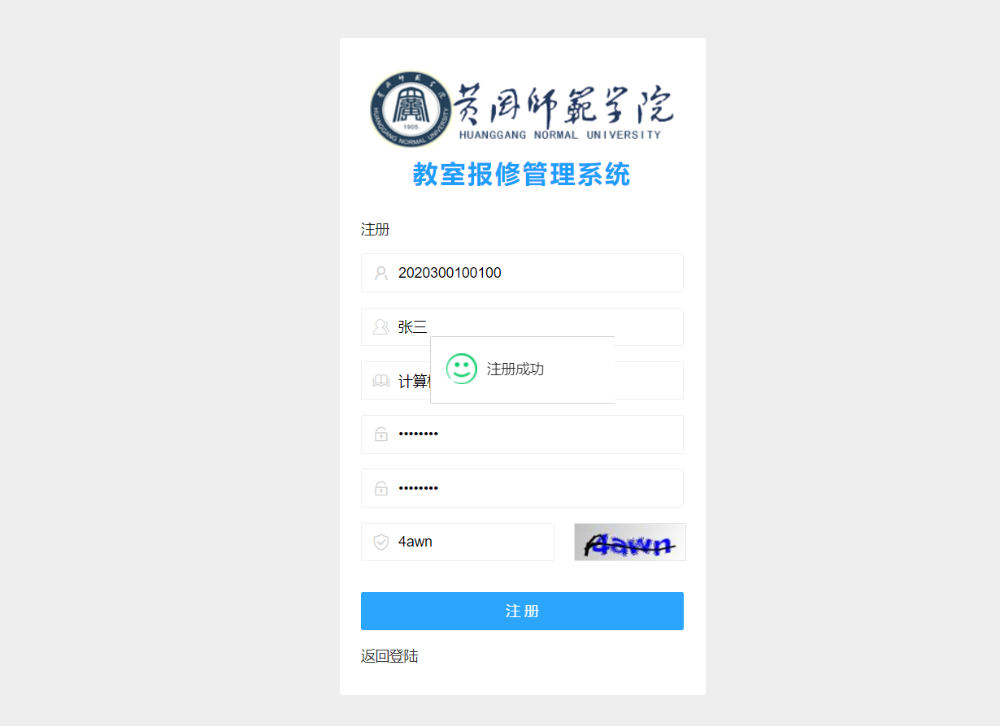


点击左侧栏创建维修单，填写教室号，故障描述，选择设备分类和所在教学楼。

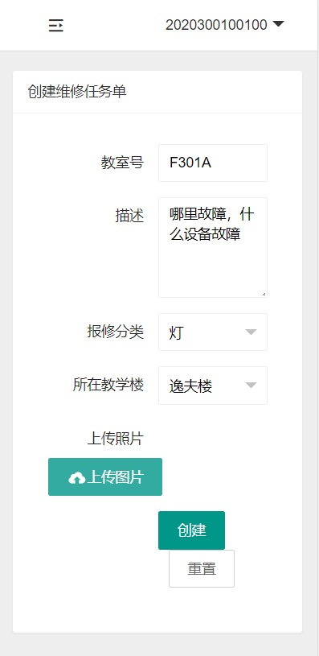

上传照片，需要您使用系统相机拍照之后，点击上传图片按钮选择相应照片上传，上传完成会显示预览图片，点击创建即可。

创建完成之后，点击侧边栏我提交的维修单，即可看到维修单状态，请在所报修任务维修完成之后（一搬一周之后），如已维修，请点击审核通过按钮，完成审核。每学期统计数据将以审核完成的数量为主发放学分。

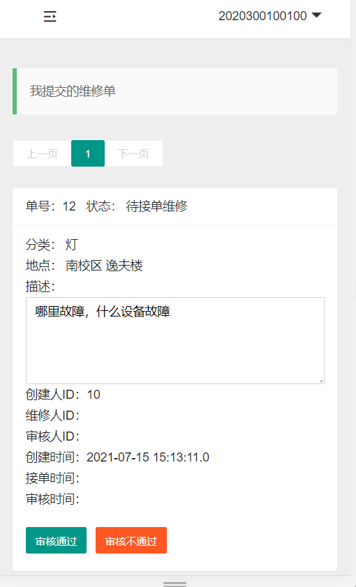

### 维修工

> 待补充

### 管理员

系统在第一次安装运行后，默认设置第一个注册的用户为管理员。

管理员可查看全部维修单，并导出维修单。

首次登录成功请在系统设置内设置系统域名，如`https://mana.eas1.cn`(最后请不要添加斜杠)

系统初始化应包含以下步骤：

1. 添加校区

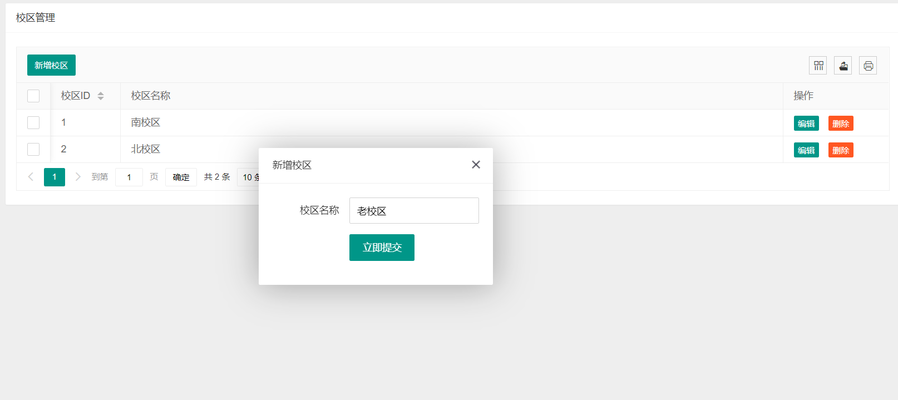

2. 添加教学楼

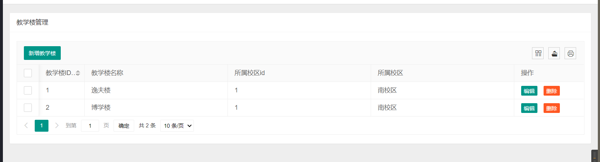

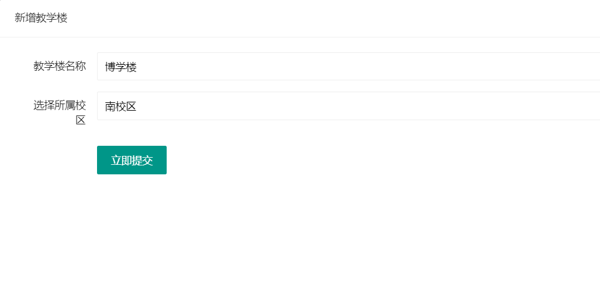

3. 创建分类

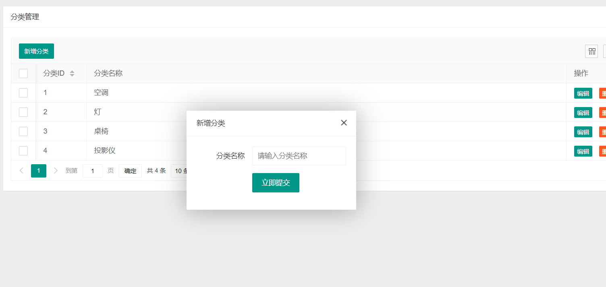


#### 用户管理

默认情况下，系统允许用户自主修改个人信息，但不包括学工号，管理员可在用户管理界面修改用户所有信息包括学工号，可设置用户的权限角色。

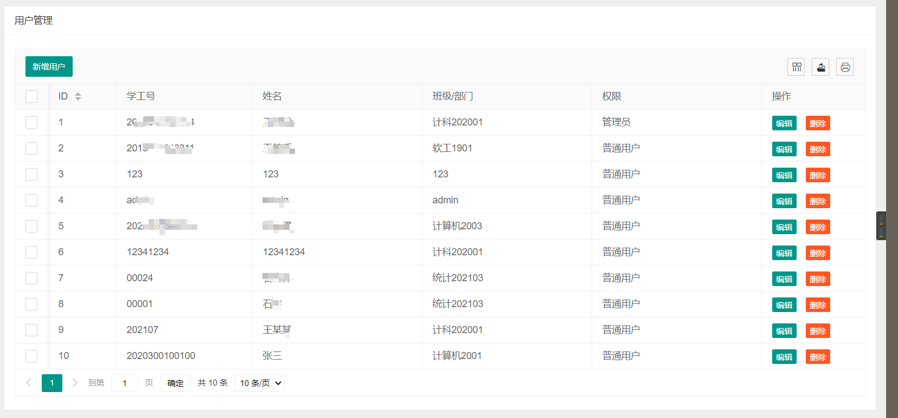

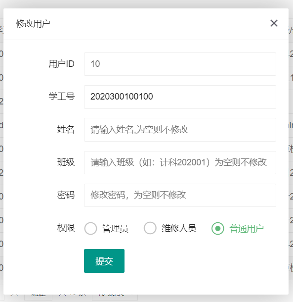

#### 导出数据

系统支持选择时间区间进行数任务单数据的导出，默认选择不包括当天的前一周提交的所有维修单数据，点击提交导出请求按钮，将会进行处理，稍等片刻，从下方的表格处点击下载按钮即可下载。

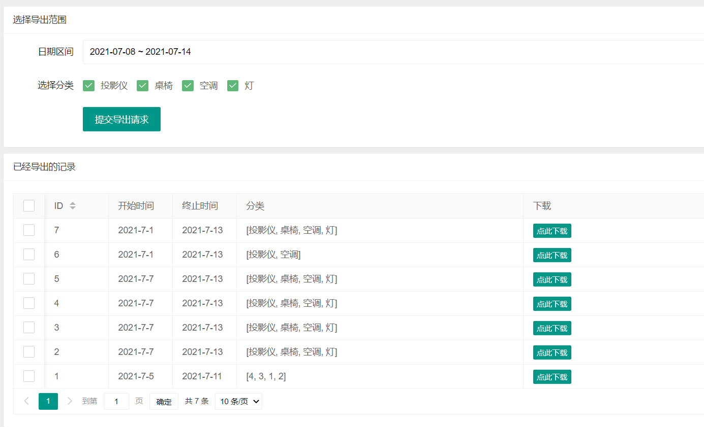

> 导出时间与服务器性能和数据数量有关，在开发者设备测试时，7万条数据导出时间在十秒钟左右。

导出的EXCEL字段如下：

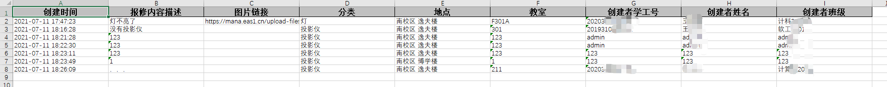

## 反馈

邮箱: support#kaygb.com(#替换为@)

QQ: 511425672

