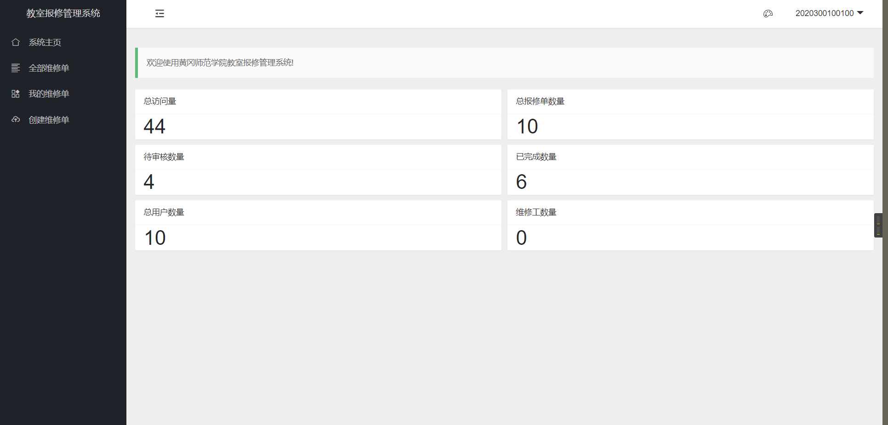

## 系统介绍

一款为校园内教室设备报修而设计的系统，包括两种角色：管理员和信息员 。~~包括三种角色（管理员，维修人员，普通用户）~~

报修流程：

1. 信息员登入系统，点击故障报修，选择故障对象的位置和故障分类，填写故障描述，上传故障照片。
2. 管理员通过后台导出故障数据提交给维修公司维修。
3. 信息员查看所报修对象是否维修完成，并在系统确认维修状态。


## 使用帮助

### 普通用户

注册账号或者使用管理员分配的账号登录到系统中




点击左侧栏创建维修单，填写教室信息，故障描述，选择设备分类和所在教学楼。


#### 用户管理

默认情况下，系统允许用户自主修改个人信息，但不包括学工号，管理员可在用户管理界面修改用户所有信息包括学工号，可设置用户的权限角色。


#### 导出数据

系统支持选择时间区间进行数任务单数据的导出，默认选择不包括当天的前一周提交的所有维修单数据，点击提交导出请求按钮，将会进行处理，稍等片刻，从下方的表格处点击下载按钮即可下载。


> 导出时间与服务器性能和数据数量有关，在开发者设备测试时，7万条数据导出时间在十秒钟左右。

导出的EXCEL字段如下：


## 开发

### 普通部署

所需环境及软件：

- 64位Linux系统(建议Centos7，Ubuntu1804及以上)
- OpenJDK11  (下载地址：[Java Platform, Standard Edition 11 Reference Implementations](http://jdk.java.net/java-se-ri/11))

- Mysql8.0 （5.7 及以上）或MariaDB（推荐）
- nginx（可选）

在根目录创建文件夹，然后上传Jar包到服务器

```bash
cd /
mkdir hgnuman
// 上传jar包
```

然后使用以下命令运行：

```bash
sudo -u root nohup /usr/bin/java -jar /hgnuman/hgnuman.jar --server.port=8036 >> /hgnuman/hgnuman.log 2>&1 &
```

等待一分钟左右，访问：`http://ip:8036` 查看是否启动成功，系统日志科查看`/hgnuman/hgnuman.log`

### 使用Docker部署

创建文件夹

```bash
sudo mkdir /opt/hgnuman/app
sudo mkdir /opt/hgnuman/files
```

将jar包和antispanmy.xml到files目录下，并复制jar包到app目录下
进入app目录编写Dockerfile

```bash
vim Dockerfile
```
写入以下内容

```bash
# Docker image for hgnuman
# VERSION 1.3.0
# Author: kaygb
# 基础镜像使用openjdk11
FROM openjdk:11
# 作者
MAINTAINER kaygb <hi@kezez.com>
# VOLUME 指定临时文件目录为/tmp。
VOLUME /tmp
# 将jar包添加到容器中并更名为app.jar
ADD hgnuman-1.3.0-RELEASE.jar /opt/hgnuman/app.jar
RUN mkdir /opt/hgnuman/upload-files
RUN mkdir /opt/hgnuman/export
RUN mkdir /opt/hgnuman/import
# 运行jar包
RUN bash -c 'touch /opt/hgnuman/app.jar'
ENTRYPOINT ["java","-jar","/opt/hgnuman/app.jar","--server.port=8036",">>","/opt/hgnuman/log/hgnuman.log","2>&1","&"]
```
保存后构建容器镜像

```bash
sudo docker build -t hgnuman .
```

启动容器

```bash
sudo docker run -d -v /opt/hgnuman/files:/opt/hgnuman --net=host --privileged=true hgnuman
```

> 注意：如容器没有正常运行，请确认app.jar 在`/opt/hgnuman/files`中是否存在

更新系统（更新jar包）

```bash
sudo docker ps -a // 查看所有容器以及容器ID
sudo docker stop xxxxx(容器id） // 停止容器
sudo rm -r app.jar  // 删除旧包（或修改文件名称）
// 上传新的jar包

sudo docker start xxxxx(容器id)启动容器，更新完成。
```

> 查看日志命令：sudo docker logs hgnuman 


## 反馈

请查看关于页面。


> 最后更新时间：2022-01-10
