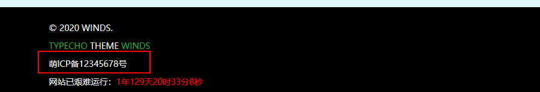

入坑了typecho，那就要留点纪念呀！一款typecho主题，免费开源，虽然写的并不是很好，比不上大佬的主题，但是还是希望大家能够喜欢！

> 非常感谢VOID的作者熊猫小A同意参考VOID的导航栏样式
> 部分样式借鉴 VOID Material sagiri ，非常感谢！

## 安装

> 即将发布，暂未公开，敬请期待！

下载最新release：[点击这里下载最新版本](https://github.com/kaygb/typecho-theme-winds/releases)

下载主题包，上传至typecho主题目录，解压并更名文件夹为：WINDS

## 主题设置

### 站点名称

这里的设置和typecho后台的基本设置不冲突，只用来显示在导航栏左侧，以及头部标题的位置。

### 背景图片地址

填入一张图片URL，可以是CDN外链，也可以相对路径，支持随机图片API，并添加了懒加载动画。

### 站点logo地址（favicon）

这里可以填入相对路径，或者图片外链。将会在浏览器的标签上显示。

### 个人卡片头像

填入自己的头像URL

### 个人卡片大图

显示在侧边栏的个人信息卡片的背景图片，添加了懒加载，支持外链和相对路径。

### 首页文章摘要字数

未完工，待续...

### 自定义head标签内容

输出在html文档流的head标签内。

### 自定义导航栏

用来显示自定义的页面，需要在外部添加`li`标签，请按照格式填写：

如果需要点击之后在新标签页打开，需要添加` target="_blank" `属性。

~~~html
<li><a href="//winds.eas1.cn/archives.html">归档</a></li>
<li><a href="//eas1.cn" target="_blank">主站</a></li>
~~~

### 自定义footer标签内容

输出在页面底部

### 备案号

填入备案号将在底部显示

## 反馈

[点击此处提交ISSUE](https://github.com/kaygb/typecho-theme-winds/issues)